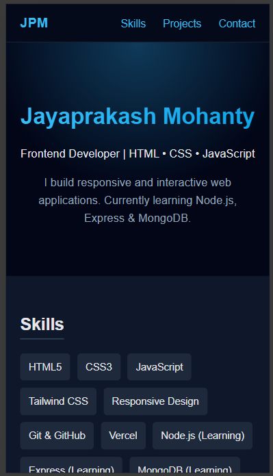

# 🚀 Jayaprakash Mohanty — Developer Portfolio


> A modern, fast, and fully responsive personal portfolio showcasing my web development projects, skills, and contact information.

---

## 🔴 Live Website

🌐 **Portfolio:** https://my-portfolio-tau-seven-46.vercel.app/
💻 **Repository:** https://github.com/jayprakashm578/My-portfolio

---

## ✨ Highlights

* 🎨 Clean & modern UI
* 📱 Fully responsive (mobile-first)
* ⚡ Optimized performance
* 🧩 Project showcase with live demos
* 📬 Functional contact section
* 🌐 Deployed on Vercel
* 🔍 SEO-friendly structure

---

## 🛠️ Tech Stack

**Frontend**

* HTML5
* CSS
* Vanilla JavaScript

**Tools & Deployment**

* Git & GitHub
* Vercel

---

## 📸 Screenshots

<p align="center">
  
  
</p>

---

## 📂 Folder Structure

```
portfolio/
│
├── assets/
├── favicon.ico
├── index.html
└── README.md
└── script.js
├── style.css
```

---

## 🚀 Run Locally

```bash
# Clone the repo
git clone https://github.com/jayprakashm578/My-portfolio

# Go into the project
cd My-portfolio

# Open in browser
open index.html
```

---

## 🧑‍💻 About Me

I am a **B.Sc Computer Science graduate** and passionate web developer focused on building clean, responsive, and user-friendly web applications.

Currently working on:

* 🔹 Frontend development
* 🔹 Full-stack projects
* 🔹 Freelance web work

---

## 📬 Contact Me

📧 Email: [jayprakashm578@gmail.com](mailto:jayprakashm578@gmail.com)
🐙 GitHub: https://github.com/jayprakashm578
🌐 Portfolio: https://my-portfolio-tau-seven-46.vercel.app/

💼 **Available for freelance and entry-level opportunities**

---

## ⭐ Show Your Support

If you found this project helpful, please give it a ⭐ on GitHub — it helps a lot!

---

## 📄 License

This project is licensed under the MIT License.
